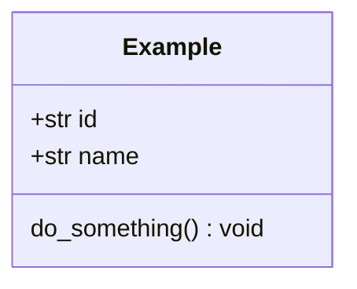

# 設計

支援ツール（`04_プログラム`配下）を作る場合の設計ドキュメント置き場。

クラス図・シーケンス図をMermaid記法で書いておくと、Claude Codeなどのツールと設計内容を共有しやすい。

```mermaid
classDiagram
    class Example {
        +str id
        +str name
        do_something() void
    }
```

小さなCLIツールであっても、先に設計を1枚書いておくと、後から見返したときに意図が分かりやすい。
